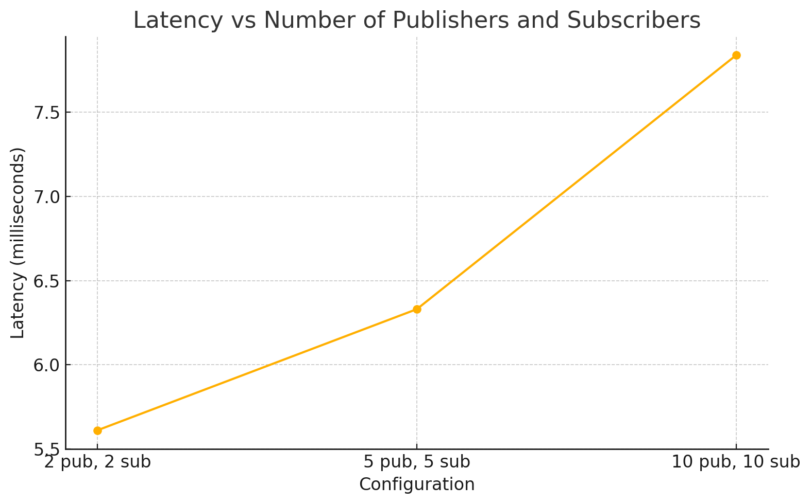

# Testing Results

**Components:**
- 3 Discovery Services
- 3 Brokers
- 1 Load Balancer
- 1 Zookeeper instance

> The 3 discovery services, 3 brokers, and 1 load balancer were all deployed on different VMs.

**Test Variations:**
- 2 subscribers, 2 publishers
- 5 subscribers, 5 publishers
- 10 subscribers, 10 publishers

**Results:**
- 2 publishers, 2 subscribers: 5.61 milliseconds
- 5 publishers, 5 subscribers: 6.33 milliseconds
- 10 publishers, 10 subscribers: 7.84 milliseconds

**Graphs**

