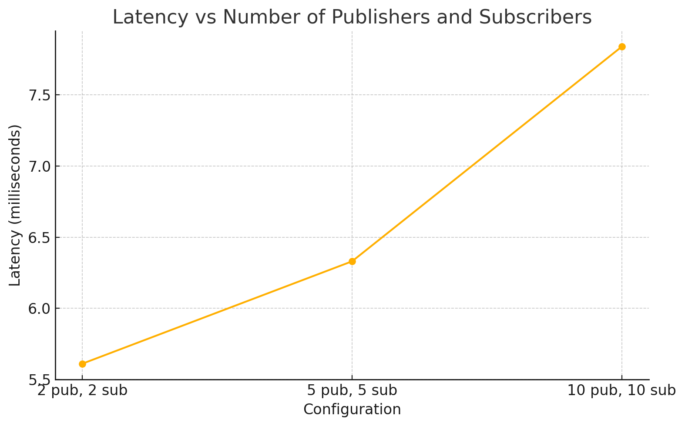

# Testing Results

**Components:**
- 3 Discovery Services
- 3 Brokers
- 1 Load Balancer
- 1 Zookeeper instance

> The 3 discovery services, 3 brokers, and 1 load balancer were all deployed on different VMs. We measured using influxDB, end to end measurements were taken at the subscriber, where publishers would include time of publishing when they sent out messages, so results are subject to clock drift. 

**Test Variations:**
- 2 subscribers, 2 publishers
- 5 subscribers, 5 publishers
- 10 subscribers, 10 publishers

**Results:**
- 2 publishers, 2 subscribers: 6.22 milliseconds
- 5 publishers, 5 subscribers: 6.71 milliseconds
- 10 publishers, 10 subscribers: 8.52 milliseconds

**Graphs**

PA4: 

For comparison PA3:

Not a significant change from our PA3 results. We implemented most of the features before the spec was changed for PA3, the only additional feature was the deadline QoS. This new feature wouldn't be expected to add latency to the vast majority of messages, which come before the deadline anyway, so I think the results are fairly expected. 
